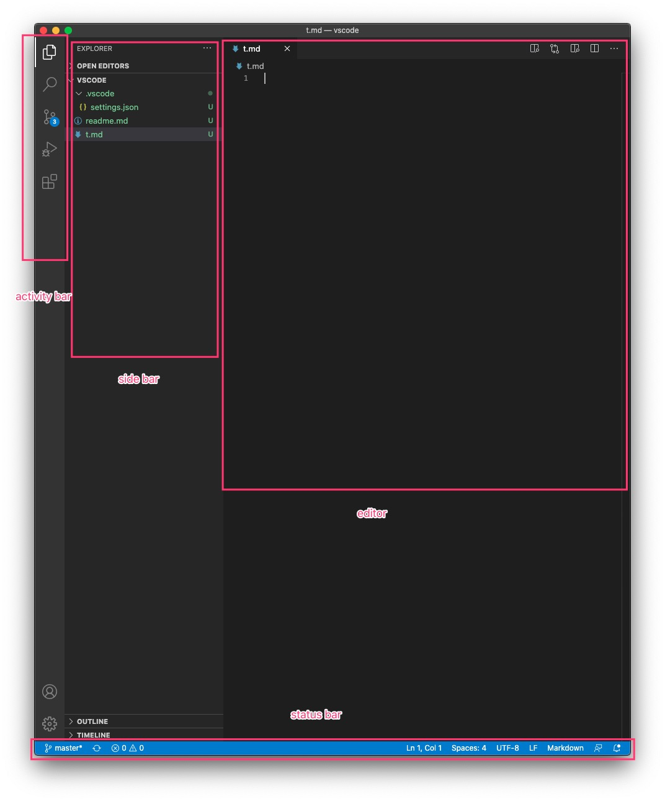
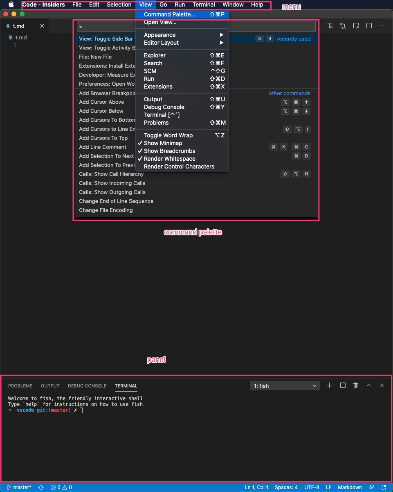
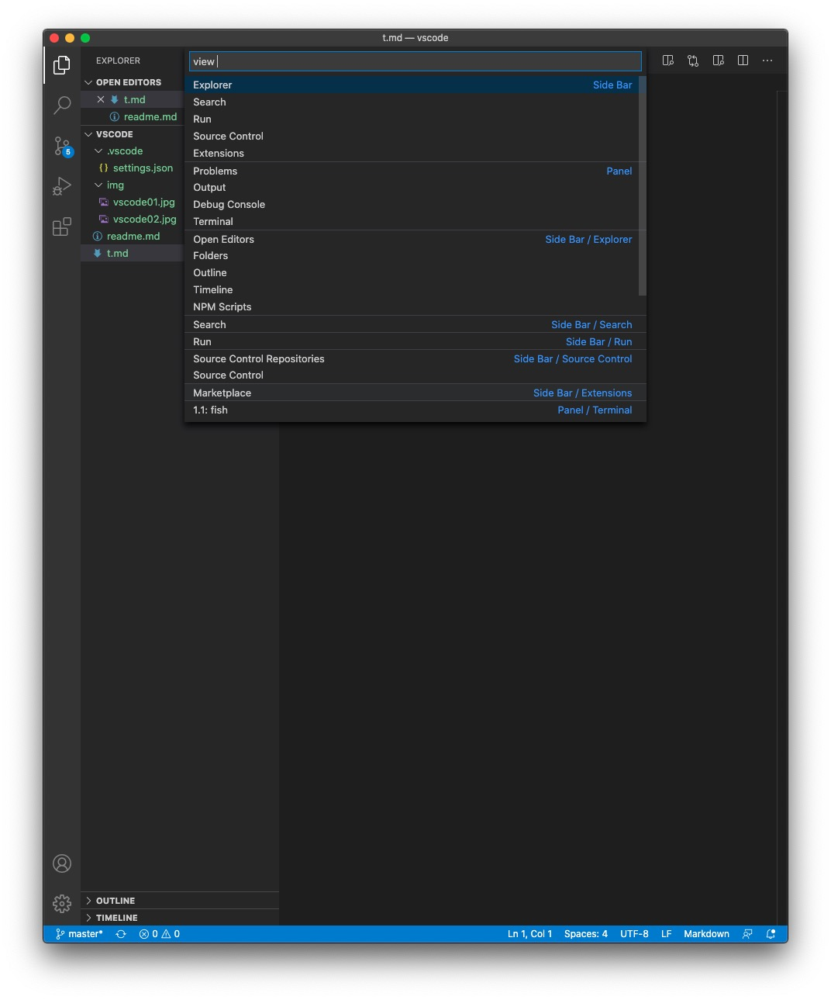
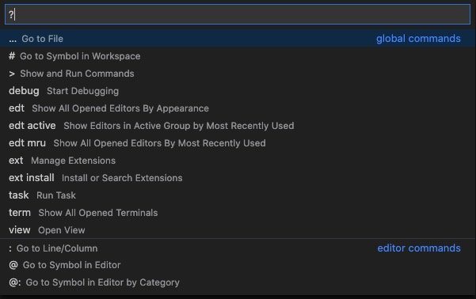

# vscode 学习之旅

以下内容使用 mac 下的 vscode insider 版本, 思路是一致的

## 荐书: vscode 权威指南
- 「我知道, 我改行动了. 这是一片即将变红的蓝海」 -- 作者简述结识相伴历程, 于 2016.6 开始开发 vscode 的插件
- zen
    - 搜索 -> 文档工具整理
    - 提问
        - [提问的智慧](https://github.com/ryanhanwu/How-To-Ask-Questions-The-Smart-Way/blob/master/README-zh_CN.md)
        - 不仅需要好的问题, 也需要好的解决方案
    - 学习
        - 自己思考
        - what-how-why
        - 举一反三: 通过 **类比** 等手段, 调用自己已有的知识
- vscode 如何做开源
    - github: issue & pull request(PR)
    - 开发流程: roadmap/年 产品设计/月初 测试与发布/月末
    - 文档
    - 插件
- 想了解更多细节, 融入 vscode 大家庭, 这本书你值得拥有

## 名与实
> 名与实的重要性: 很多问题往往只是「语义上」的, 要么是不清楚概念(名), 要么是不清楚概念具体指的是什么(实), 要么就是翻译转换过程导致的名实不符
> 很多问题其实并不难, 只是前面叠加了一层 **名与实** 的问题, 所以很难, 因为这种问题: 知道就是知道, 不知道就是不知道

本教程会尽量使用 `英文简写/英文原文`
- 避免英文翻译产生的歧义
- 英文翻译需要产生一次思维转换
- 编程世界, 对英文太友好了
- 简写 = 约定俗成 = 更简洁一些
---

部分清单清单, 按照 `[英文简写],[英文原文] [中文常用翻译]` 的格式

---
- file 文件, folder 文件夹
- workspace 工作区, 通常一个项目可以作为一个工作区, vscode 可以在工作区之间快速切换
- command palette, 命令面板, vscode 很多功能都是一个又一个 command, 通过 command palette 可以快速执行 command
- shortcut 快捷键
- keymap 快捷键映射
- code fold 代码折叠, 折叠代码块, 方便查看
- encoding 编码, 编码的更多信息, 参考这本书 [编码：隐匿在计算机软硬件背后的语言](https://book.douban.com/subject/20260928/)
- source control 版本控制, 使用最多是 git, 下面使用 git 代替
- compiler/interpreter 编译器/解释器, 有些语言需要编译后运行, 如 `java+javac`, 有些语言可以直接运行, 如 `php/python`
- extension 插件, 后文多使用 `ext` 简写
---
- workbench 工作台, 大致等同于打开的 vscode window, 在 theme 设置时会用到
- editor 编辑器, 主要 coding 的部分
- editor layout 编辑器布局, 常用 **双开**
- line number 行号, 是否显示行号
- gutter 行号与编辑器之间的间隙, 通常展示 git变更/breakpoint 等信息
- codeLens 界面控件, 一般位于 函数/类 上面, 用来快速执行命令, 如 jupyter notebook / rest client
---
- lint compile build test deploy 代码静态检查/编译/打包/测试/部署
- debugger formatter linter 调试工具/代码格式化工具/代码静态检查工具
- highlight bracket intellisense lint quickfix go snippet format debug refactor 代码高亮/括号匹配/智能提示/静态检查/快速修复/代码导航/代码片段/格式化/调试/重构
- IntelliSense 智能提示
- IntelliCode 基于AI的智能提示
- LSP, language server protocol, 包含 completion formatting definition 等功能
- DAP, debug adapter protocol
- TS, TypeScript; js/JS, JavaScript
- FE, front end 通常代指 前端开发

## 认识 vscode
> 认识论: 先整体后局部; 先通用后细节
> 知识成体系的重要性: 因为遗忘的存在, 学习是需要不断重复的, 不成体系的知识, 难以区分哪些是重要的, 进而陷入到细节当中



- 先整体后局部
    - activity bar(局部下还有很多功能)
        - explorer
        - search
        - source control
        - run
        - extension
    - side bar
    - editor
    - status bar
---


- 先通用后细节
    - menu: 大部分功能都可以在 menu 中找到, 并且 menu 已经帮我们进行了 `分类`
    - <a id="command">command palette</a>
        - vscode 中的大部分功能, 都是 `command`
        - 如图: 使用 `menu > view > command palette` 就可以打开, 后面是快捷键
    - panel
---



`command palette` 已经非常 **通用** 了, 其实它上一级的 `view` 更通用, 几乎所有的功能, 都是一个又一个 <a id="view">`view`</a>
- `?`: 查看有哪些 `view`
- `...`: 空的时候, 用来打开文件
- `>`: 上面看到的 command palette
- `view `: 打开各种界面

## vscode landscape

有了上面的思路, 我们不妨来一张 vscode 的 landscape(全景图)

- <a id="menu">menu</a>
    - code
        - about & update
        - **setting**
        - **shortcut** & keymap
        - snippet 代码片段
    - file
        - file folder **workspace**
        - add folder to workspace: 满足同一个 window 管理多个项目(multi-root workspace, 详情见 [vscode.code-workspace](vscode.code-workspace))的需求
        - autosave
    - edit
        - undo/redo cut/copy/paste
        - **find**/replace
        - comment emmet
    - selection 块选取
        - selection 范围选择
        - line 行操作
        - **cursor** 多点编辑
        - column selection mode
    - **view** 超多功能入口都在这里
        - `command palatee`: landscape 中的几乎所有英文内容, 几乎都能通过 command 控制
        - open view
        - appearance
            - 各独立 view 的控制, 如 side bar / editor / panel
            - zen mode 禅定模式
        - **editor layout** 编辑区域多开
        - activity bar 相关
            - explorer 文件管理器
            - **search** 搜索
            - source control
            - run
            - extension
        - panel 相关
            - output
            - debug console
            - **terminal**
            - **problem** 帮助快速修复错误
        - word wrap / minimap / breadcrumb / whitespace
    - go 跳转
        - back / forward 在前后位置间跳转
        - last editor location 快速跳回上次编辑位置
        - file / symbol / line / problem 等内容, 在 [view](#view) 可以看到
        - 语言相关功能: definition / declaration / type definition / implementation / reference
        - bracket 闭合符号(括号等)跳转
        - change
    - run
        - run
        - debug
            - breakpoint 断点
            - step over / step into / step out / continue
    - terminal
        - terminal
        - task, 如 build, task 放这里是因为 task 是通过 terminal 来执行的
    - window
    - help vscode 相关资源

有了这样一个全景图, 我们就可以开始不断认识/深入 vscode 的细节

## vscode core
> 在深入细节之前, 了解一下 vscode core, 会在遇到问题时 **从容** 很多: 上层的问题往往是一层又一层的封装后导致问题的本质 **不可见**, 从 core 来理解往往 **事半功倍**

- Electron 跨平台桌面应用
- Monaco Editor 基于浏览器的代码编辑器
- TypeScript 给 JavaScript 带来类型支持的编程语言
- LSP
- DAP
- xterm.js 把完整的终端功能带到浏览器
---
> 计算机科学领域的任何问题都可以通过增加一个间接的中间层来解决.

- 在没有 LSP 时, 不同语言为了给不同编辑器实现智能提示的功能, 问题规模是 $M*N$
- 引入了 LSP 后, 编程语言和编辑器都只需要和 LSP 对接, 问题规模是 $M+N$
- 同理, 引入 DAP
- 更深入思考下: 社会分工越来越细, 各行各业制定标准
---
- IntelliSense: 编程语言 -> LSP -> vscode 编程语言插件 -> vscode editor
- debug: 编程语言 -> 编程语言 debug tool(如: go 使用 delve, PHP 使用 xdebug) -> DAP -> vscode debug adapter(如: php debug 扩展) -> vscode debug

## 通用技巧

在继续深入之前, 了解一些通用技巧, 可以 **事半功倍**:

- 搜索
    - 几乎所有 [view](#view) / setting / shortcut 都支持搜索功能
    - 搜索支持 **模糊匹配**, 技巧是 **单词前缀匹配**, 比如 `view: toggle zen mode`, 输入 `zem` 就能找到了
    - 很多地方都支持搜索, 可以试试`cmd-f` 快捷键
    - 很多地方隐藏搜索功能, 直接输入字符进行 **前缀过滤**
- 二八法则: 只要花很少的时间掌握通用功能, 就能完成大部分工作
    - [command](#command)
    - [view](#view)
    - [menu](#menu)
    - shortcut /setting 等就是反例, **自然使用, 不用刻意练习**
- 自动提示: 好的工具往往不需要你记忆大量的细节, 编辑过程中的自动提示会让你 **如虎添翼**

## vscode install
- 跨平台
- stable vs insider: insider 版更新更快; 2 个版本相互独立

安装好后, 可以添加 code 命令行工具, 方便命令行下打开 file/folder:

```sh
# mac 下添加 vscode 到命令行
# 使用 icode 是为了和稳定版的 code 进行区分
ln -s /Applications/Visual\ Studio\ Code\ -\ Insiders.app/Contents/Resources/app/bin/code /usr/local/bin/icode

# 查看 icode 支持的功能
icode -h
icode -d file1 file2 # 比较文件
```

## vscode status bar
提供相关信息, 点击后可以进入快捷操作:
- <a id="status-git">git 信息</a>
- 编程语言 compiler/interpreter
- problem
- 当前 line/column
- space/tab 信息
- encoding
- language mode 识别当前是哪种语言
- tweet feedback
- notification

## vscode command

menu / view 中有的, 通常也是最常用, 这里就不赘述了, 这里记的内容比较小众, 可以略读

- `reveal in explorer/finder`: 快速在 vscode/系统 explorer 中查看当前文件

## vscode editor

- find/replace: 搜索支持 **正则匹配** / 大小写 / 全文 / 换行
- gitter 区域: code fold

## vscode explorer

- 文件列表支持过滤: 看到没, **搜索** 的功能又来啦
- 支持多选以及 compare(文件 diff)
- 支持在 file/folder 下进行 find/replace, 搜索支持 **正则匹配** / 大小写 / 全文 / 换行

## vscode setting

- vscode 几乎所有内容都可以设置
- 配置范围: default / user / workspace / folder
- 格式: UI / json
- 打开方式: `command > setting` / `cmd-,`
- setting sync

> 更多说明 & 常用配置, 见: [settings.json](.vscode/settings.json)

## vscode shortcut

- **不要刻意去记 shortcut**, command/view/menu 等场景都会显示功能对应的快捷键, 经常使用的快捷键, 自然会记住
- 格式: UI / json
- 可以在 shortcut 配置界面, 可以通过功能搜索 shortcut, 也可以通过 shortcut 搜索功能, 也可以通过 `show same keybinding` 查找快捷键冲突
- 默认的快捷键往往就够用了 -- 用到 2% 就不错了, 不用花太大经历折腾
- keymap 并不建议, 不同编辑器在 **名** 在都有细微的区别, **名实** 清晰往往可以走得更远

经常使用的快捷键:

```
# 务必记住
f1 打开 command palette
cmd-p 默认是搜索文件, 通过输入, 切换不同 view

# 视自己使用情况而定
cmd-, 打开设置(mac 下通用快捷键)
cmd-\ editor 双开
cmd-. quick fix 快速修复
cmd-w close window
cmd-b toggle sidebar
cmd-j toggle panel
ctrl-` toggle terminal
ctrl-g go to line/column
f12 go to definition
ctrl-r open recent, 快速切换 workspace/file
f8 go to problem
```

这里着重提供一个特殊的 shortcut: `cmd-shift-h`
- `command` 包含所有 menu 中的功能, 这个 shortcut 用得并不多
- mac 提供, 可以搜索 menu 中的所有功能, 在其他没有 `command` 功能的应用中, 就非常有用了

## vscode terminal
- `ctrl-`\` `view: toggle termianl` 终端间切换
- `terminal: set default shell`

## vscode git

- `git: ` command palette 可以快速执行 git 命令
- `toggle inline view` git diff 可以选择 2 种不同视图
- [status bar](#status-git) 可以查看 git 信息
- code 设置为 git diff/merge tool

## vscode snippet
> 可重用代码片段

## vscode task
> 重复工作自动化: lint compile build test deploy

- 自动检查, 如 npm package.json 中的 npm task, `command > run task > npm`

## vscode run/debug

debug 相关操作:
- f5 start/continue/stop/restart debug
- f9 toggle breakpoint
- f10 step over
- f11 setp in/out

## vscode extension
> 善用搜索

- 首页推荐: feature/几个月(vscode 挑选) trending/day/week most-popular(install number) recently-add
- category: debugger formatter linter ...
- sort
- 过滤器 `@`: 上面的 `category` `sort` 都属于过滤器
- workspace recommend, 详见 [vscode.workspace](vscode.code-workspace)
---
插件推荐:
- **花里胡哨**(我通常不花时间折腾这个...)
    - bracket pair colorizer 2
    - indent-rainbow
    - vscode-pigments: css 颜色
    - peacock: window 颜色
- git
    - github PR: [github desktop](https://desktop.github.com/) 操作更方便
    - git graph: 确实比 gitk 好看多了, 不过我只用 gitk 干一件事 -- `gitk file` 查看某个文件的历史记录
    - git lens: 功能太强, 全开会有点卡, 需要自己 熟悉+优化
- web
    - web template studio
    - browser preview: chromium + blink(渲染引擎) -> headless chrome(console 版) / chrome(网页版)
    - element for edge
    - debug for chrome/firefox/edge
- db 数据库管理相关
- dev 开发类
    - editorConfig: 统一代码风格
    - sortlines
    - code spell checker 拼写检查/自动修复
    - image preview
    - output colorize 为 output/.log文件添加语法高亮
    - debug visualizer 实时的可视化调试
- tool 工具类
    - todo tree / todo highlight
    - bookmarks
    - polacode 把选中的代码导出为图片格式
    - wakatime 记录开发者日常编写代码使用情况
    - codestream 团队协作/代码评审, 和 slack/Microsoft team 集成
    - paste json as code
    - data preview
    - file watcher
- 容器开发: docker kubernate
- 移动开发: flutter / react native tools / cordova tools / ionic snippet
- LeetCode
- theme 主题相关
- fun: netease / anime / epub / zhihu / 鼓励师

## vscdoe 编程语言支持
> vscode 胜在轻量, 语言支持方面, 需要进行相当多的配置, 才能到 **得心应手** 的状态, 从这个角度来看, 大概是 `vim > vscode > IDE`
- feature: highlight bracket intellisense lint go snippet format debug refactor
- `language mode` 设定语言

### python
- ext: python
- `python: ` 系列 command
    - `interpreter`: 选择 python 解释器, 即本地安装的 python 的版本
    - `python: run test` `python: discover test`
- run
    - `ext: code runner` / `run/debug`
    - REPL 交互式解释器
    - jupiter notebook
        - `ctrl-enter` 运行; `a/b` 添加 cell; `j/k` 上下移动 `l` 显示行号
        - show variables 显示变量
        - 查看 plot 图表
        - save as python script
- test
    - status bar: `run test`
    - 并行执行: `pip install pytest-xdist`
- ext: python extended / python indent / AREPL for python / autoDocstring / qt for python / djaneiro / flask / batter jinja

### js
- js = ECMAScript(语言语法 + 基本对象) + DOM(文档对象模型, 处理网页内容) + BOM(浏览器对象模型, 与浏览器交互)
- js 运行时: 浏览器(可以操作 DOM / BOM) / nodejs(可以访问 os/fs api)
- edit
    - intelliSense 类型自动获取: TS类型申明文件 `.d.ts`; JSDoc(注释)
    - 类型检查: `@ts-check` `@ts-nocheck`; jsconf/tsconfig 文件
    - autoImport
    - jsx
    - unused: 识别 & 自动移除
    - codeLens 显示引用次数
- run
    - 服务端调试 node
    - 客户端调试: `ext: debug for chrome/firefox/edge`
- lint: ESLint JSHint / flow language support / standardJS
- test: mocha(mocha 测试框架) sidebar / mocha test explorer / jest
- ext: path intellisense / import cost / quokka.js 调试工具 / code metric 代码复杂度 / js booster 重构 / abracadabra 重构 / turbo console log 自动生成log

### ts
- `npm i -g typescript` > `tsc t.js` > `node t.js`
- `npm i -g ts-node` > `ext: code runner`
- debug: `tsconfig.json + launch.json`

### java
- java 环境: `brew install openjdk` + 设置环境变量 `JAVA_HOME`, 使用 `java --version` 验证
- run: `ext: code runner` `ext: debugger for java`(java ext pack 包含, 需要配合 `launch.json`)

### c#
### c/c++
### go
### more
- php
- rust
- dart
- ruby
- lua
- r
- matlab
- D
- F#

## FE

## 云计算
- aliyun: alibaba cloud toolkit / aliyun serverless

## 物联网
## 远程
## vs family
## 成为 vs code 贡献者
## vs ext 开发